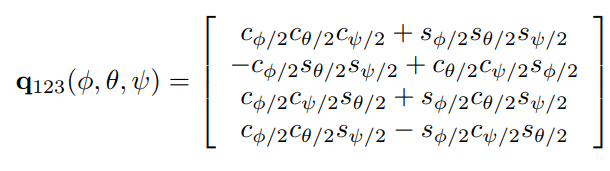
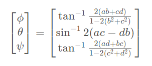
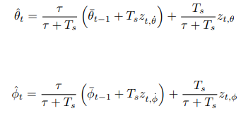
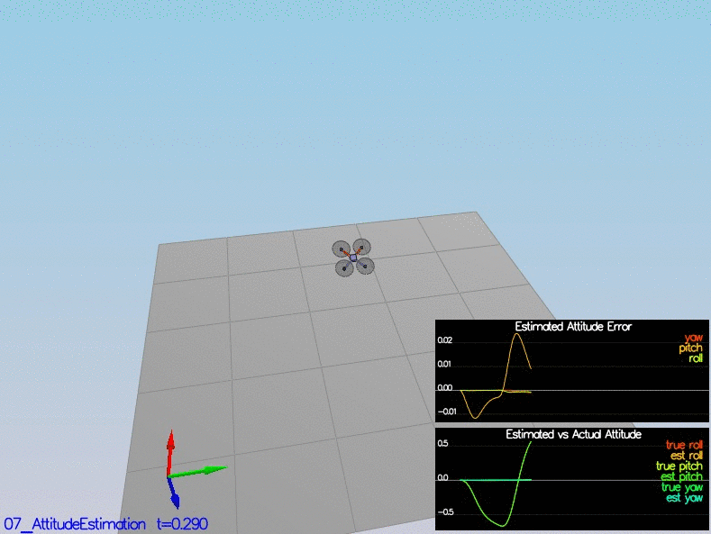
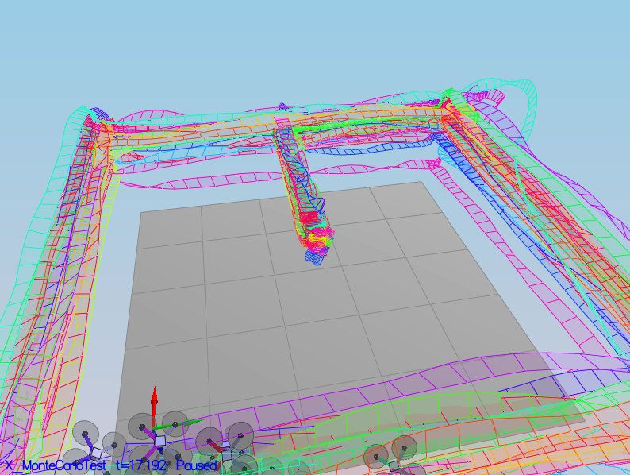

# Estimation Project #

The purpose of the estimation project is to implement a realistic estimator to make our quadcopter, equiped with noisy sensors, follow a real path.

## Project Outline ##

 - [Step 1: Sensor Noise](#step-1-sensor-noise)
 - [Step 2: Attitude Estimation](#step-2-attitude-estimation)
 - [Step 3: Prediction Step](#step-3-prediction-step)
 - [Step 4: Magnetometer Update](#step-4-magnetometer-update)
 - [Step 5: Closed Loop + GPS Update](#step-5-closed-loop--gps-update)
 - [Step 6: Adding Your Controller](#step-6-adding-your-controller)

### Step 1: Sensor Noise ###
#### Set the sensors noise ####
For the sake of this first step, a bunch of GPS and Accelerometers datas were provided to us. The aim of this part was to reacalculate the standard deviation from this datas recorded over 10 seconds at a frequency of 10Hz for the GPS and a lot more for the accelerometer. As the standard deviation follows a gaussian distribution, the calculated standard deviation was suppose to capture ~68% of the sensor mesurements. The STDs calculated we added it to the config/6_Sensornoise.txt file, linked the MeasuredStdDev_GPSPosXY and MeasuredStdDev_AccelXY values.

### Step 2: Attitude Estimation ###
#### Implement the non linear complementary filter for accelerometer and gyroscope sensors ####
To estimate the attitude we use a complementary filter. To do so and to make our attitude estimate as accurate as possible we need to use to mesurmeent of attitude, one whose come from the accelerometer and the other from the gyros. Neither of this mesurements alone can provide a reliable and responsive attitude estimate but taking together they do. There are two ways to implement the complementary filter. The linear approach which allows only smalls angle when for example the drone is close from hovering. The non-linear approach is trickier and this is the one we implemented in the project. This approach allows the drone to work for any attitude. As we get the rate in the body frame we first need to translate them to the inertial frame. We could use Eulers angle as a good representation of world frame angle but we chose the quaternions which are more robusts. We used the methods FromEuler123_RPY and .IntegrateBodyRate which make it easier to work with this attitude representation. Nevertheless the transformation matrix can be found in "Representing attitude: Euler angles, unit quaternions, and rotation vectors." from John Diebel

What does FromEuler123_RPY function do:

How to get Pitch and roll back from quaternions:

Using this predicated estimate we can then uptade the estimated attitude:

### Step 3: Prediction Step ###

#### Implement the prediction step of the filter ####

The prediction step consists in implementing the transition function and then to take the Jacobian to solve the non-linearity and update the covariance matrix. We are working with 3 fuctions: PredictState which update the first member of the transition function, GetRbgPrime which participate in building the Jacobian matrix, PredictState to predict the state forward using the output of GetRbgPrime to build the gPrime which is the Jacobian matrix itself.

### Step 4: Magnetometer Update ###
#### Implement the magnetometer update ####

Up until now we've only used the accelerometer and gyro for our state estimation.  In this step, we added the information from the magnetometer to improve our filter's performance in estimating the vehicle's heading.

### Step 5: Closed Loop + GPS Update ###
#### Implement the magnetometer update ####

### Monte Carlo Test ###

